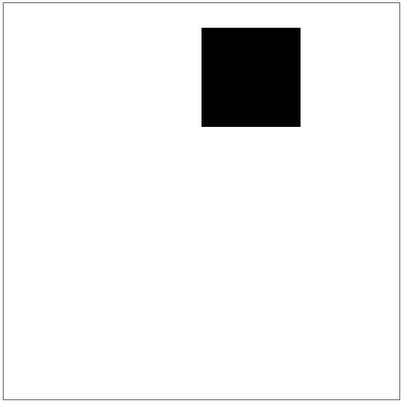
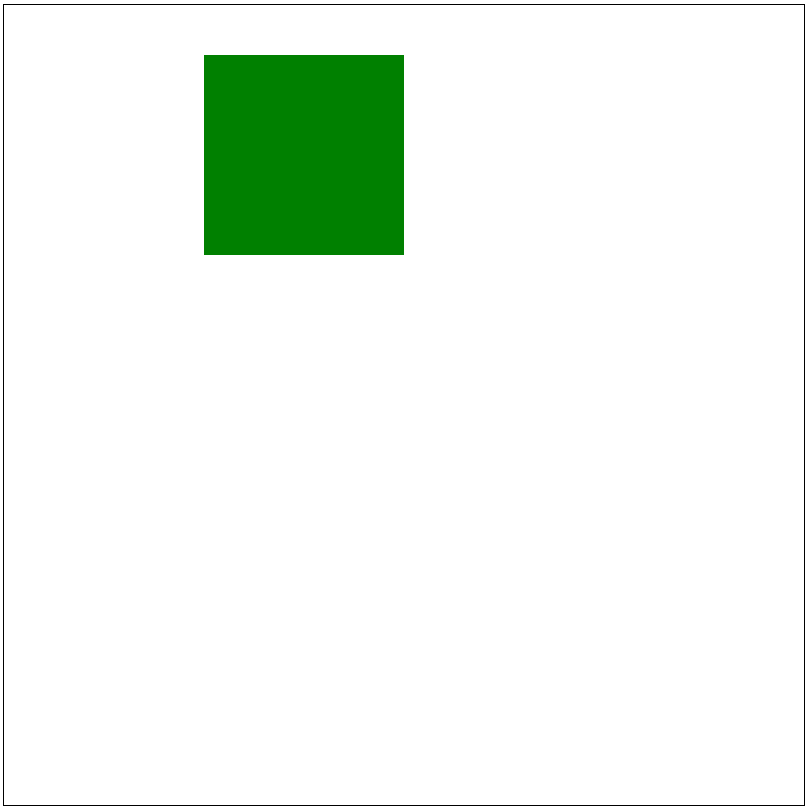

# Drawing things
## Intro
This will serve as a quick intro into how to draw stuff to the canvas. This is very spcific to drawing with javascript so I'll try to keep it brief and only tell what you'll need. You don't need to remember all this now, keep this a resouces to go back to. 

## Canvas
There are 2 lines of code at the top of code.js that initalize the canvas object. This is only important in that they need to be left along and `ctx` is the object that will be used to call canvas related functions. For example `ctx.fillRect(20, 20, 150, 100);` is used to draw a rectangle.

After your drawing functions to get them to display you need to call `
ctx.stroke();` You can do this after each drawing function or after a bunch of them. 

The canvas is 800 by 800 pixels(px) with (0, 0) at the top left and (800, 800) at the bottom right. 

## Rectangle
We only need rectangles to make snake so we'll stick to just them for a while. There are 2 kinds of rectangles, an outline and solid. Theres are drawn with `ctx.rect(x, y, width, height);` and `ctx.fillRect(x, y, width, height);`. X and Y are the top left corner of the square. Width and height are the self explanatory. For example if you wanted a solid sqaure that was 50px from the top of the canvas and 400px from the left while being 200px wide and tall, the code would be: 

`ctx.fillRect(400, 50, 200, 200);`  
`ctx.stroke();`

which would like: 

If you wanted to add a outline of a square 50px below it that would be:

`ctx.fillRect(400, 50, 200, 200);`  
`ctx.rect(400, 300, 200, 200);`  
`ctx.stroke();`

## Color 
I will be spelling colour "color" because it might come up code and it's just easier.

To set the color we are drawing in to red we can use `ctx.fillStyle = "red"` before a retangle function call. For example, this code would draw a green rectangle: 

`ctx.fillStyle = "green"`  
`ctx.fillRect(200, 50, 200, 200);`  
`ctx.stroke();`

## Tasks
1) Figure out how to use more than 2 colors.
2) Draw a face. As simple or as complicated as you want. Try to use more than.

### Sources / further reading
(I'll be linking to w3schools a lot) 
https://www.w3schools.com/html/html5_canvas.asp 
https://www.w3schools.com/tags/canvas_rect.asp 
https://www.w3schools.com/tags/canvas_fillrect.asp 
https://www.w3schools.com/TAGs/canvas_fillstyle.asp 
https://www.w3schools.com/html/html_colors.asp