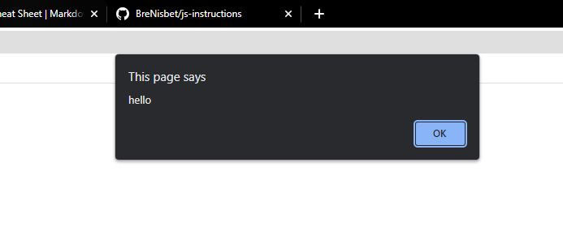

# js-instructions
## Intro
This is a set of insturctions to go through the basics of codeing. I'll be focusing on exercises that have a visual element in an rough order of what I did when learning to code. This means it will focus on game dev type stuff so if you are not intersted in that, to bad. Our first long term goal will be to make snake. Also sorry for all the spelling mistakes.

## Set up
In the folder template there's a hello world progame that will be the base of what we are working with. You can ignore site.html, this is just to have something to open. To get started download this project from github, then unzip it. Open site.html in a broswer and code.js in an IDE. For now notepad++ will work and is easy to set up but I would recommend Visual Studio Code. 

If everything is working you should see a black outline of a square in the browser. This is the outline of the canvas.

You can now add some code to code.js, save it and reload site.html it should work! I would recommend adding `alert("hello")` somewhere to code.js. If everything is working properly you should see a popup in your browser. After confirming this works remove the alert otherwise it will get annoying. 

## Congratulations! 
Time to move on to exercise 1.